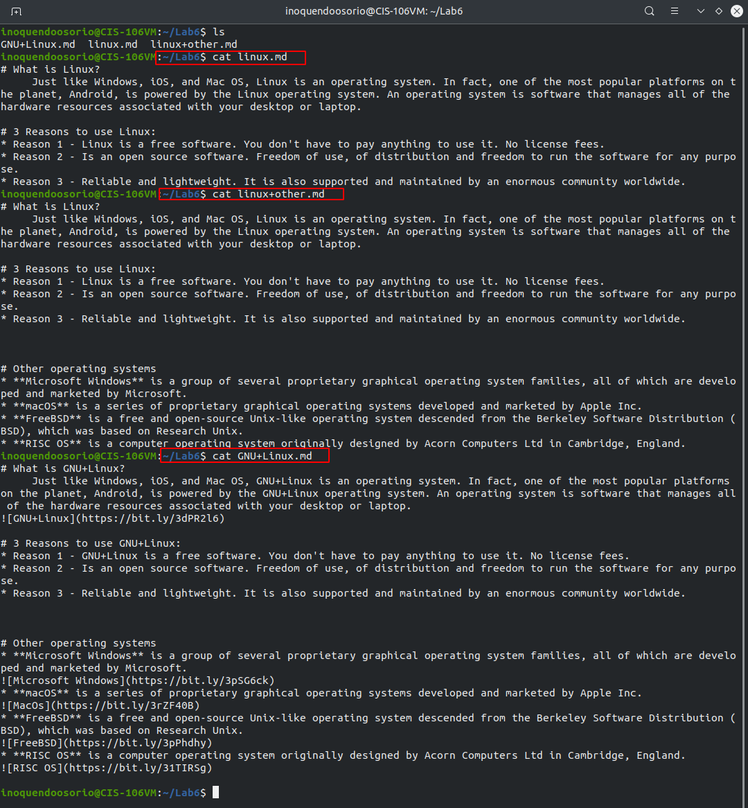
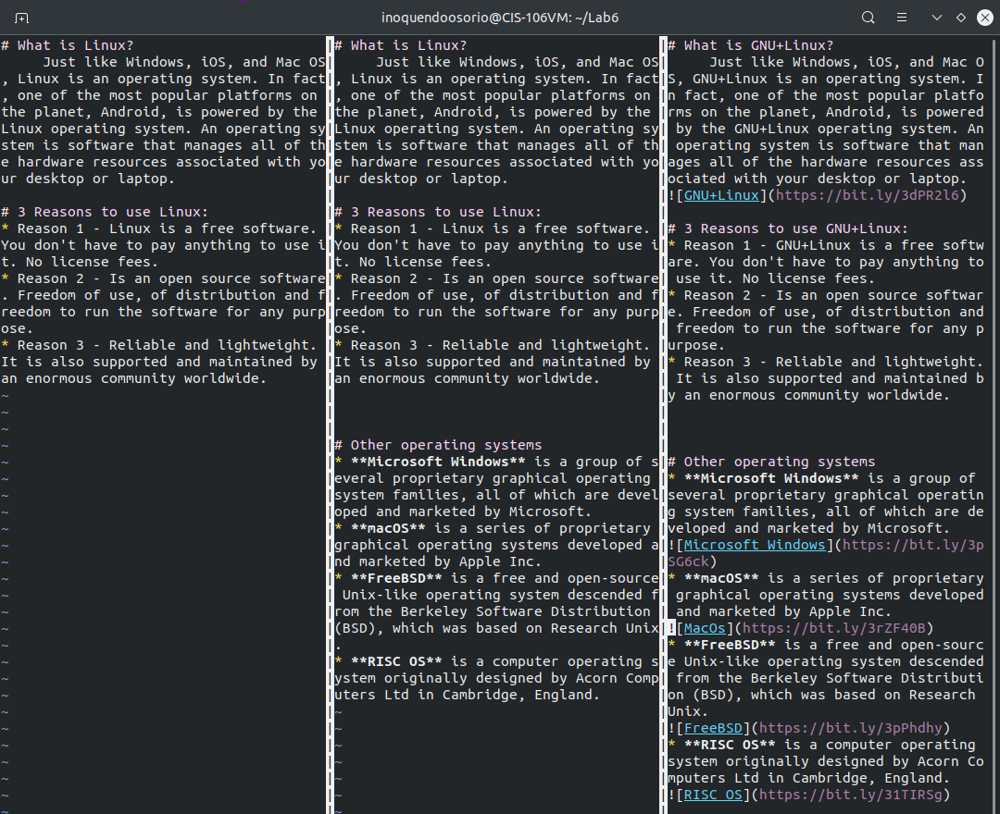

# Lab 6 | Using VIM
# Question 2
---

##### These are URL's of each of the files: [linux.md](https://github.com/Newtones91-io/cis106-fall21/blob/main/labs/Lab6/linux.md), [linux+other.md](https://github.com/Newtones91-io/cis106-fall21/blob/main/labs/Lab6/linux%2Bother.md), [GNU+linux.md](https://github.com/Newtones91-io/cis106-fall21/blob/main/labs/Lab6/GNU%2BLinux.md).