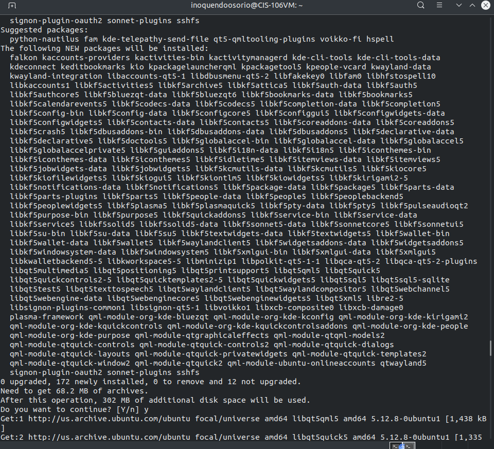
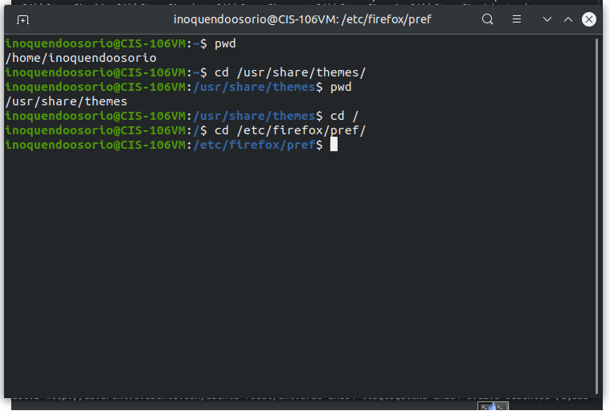
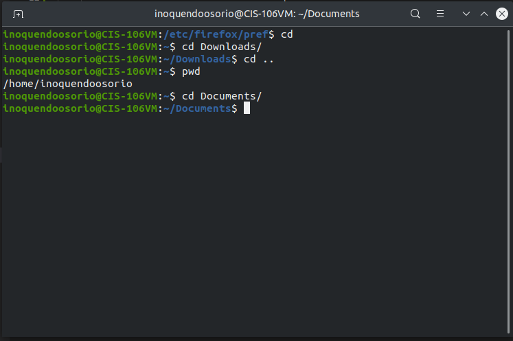
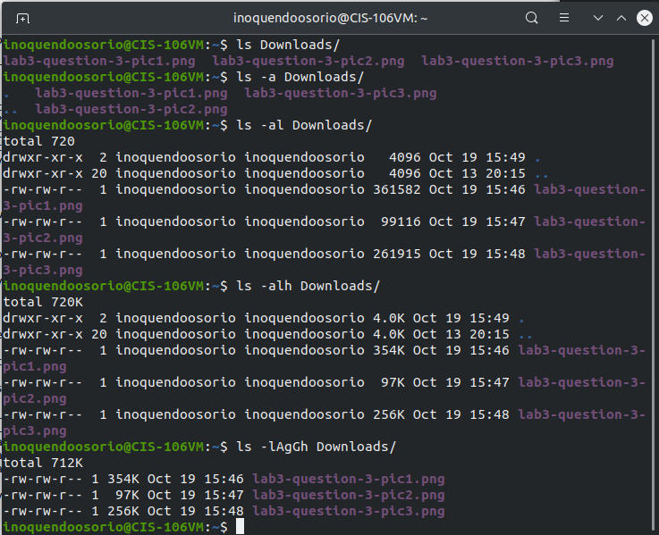
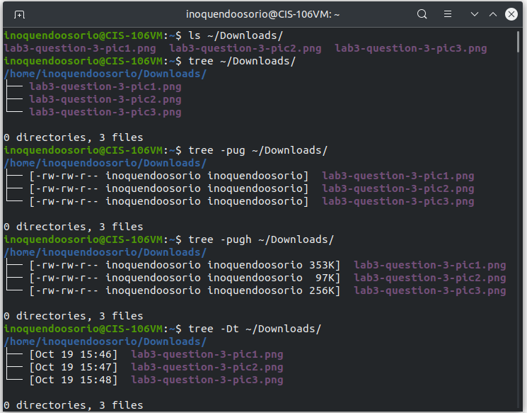
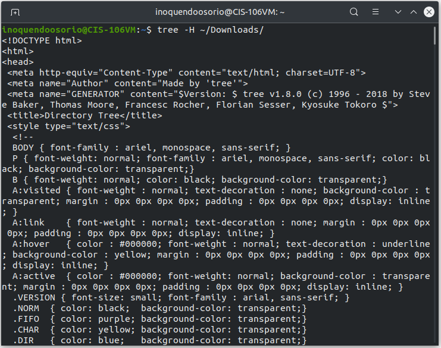
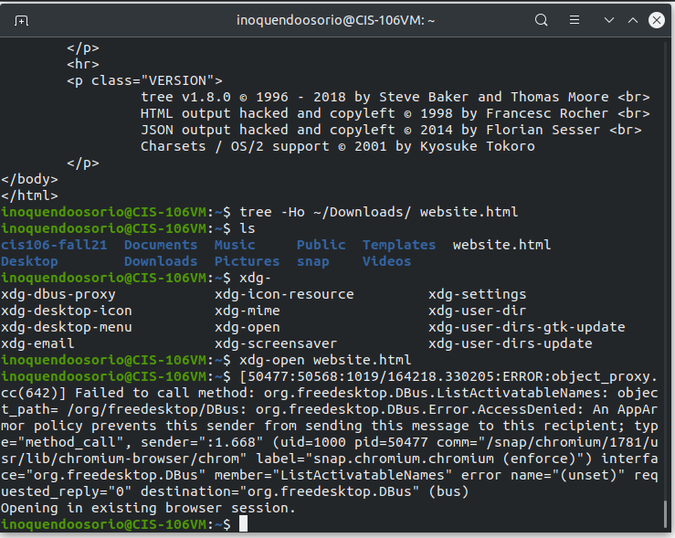
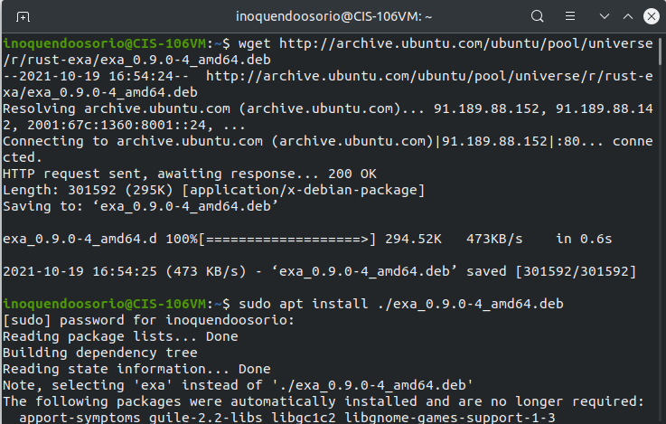
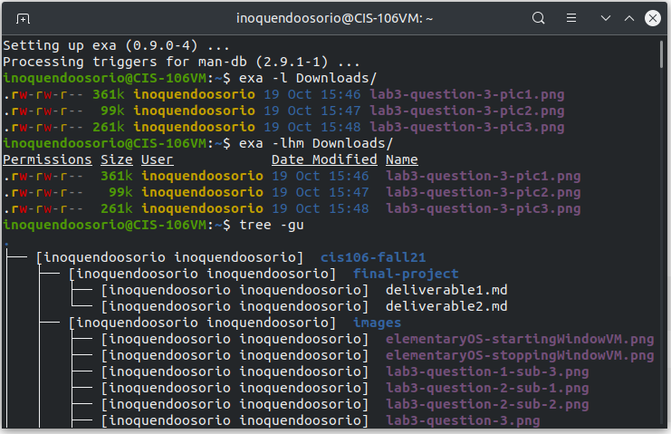
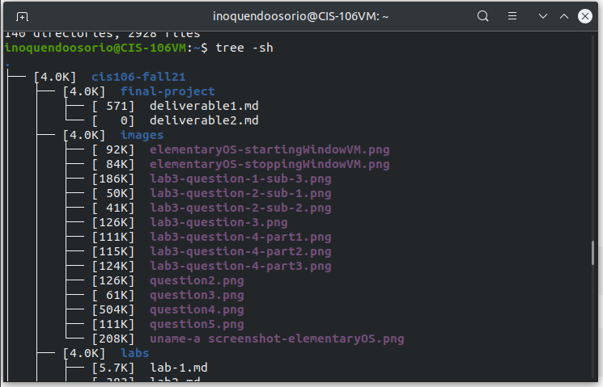

# Lab 3 | Installing software and navigating the file system | Answers
Assignment description [Lab 3 - Instructions](https://raw.githubusercontent.com/ra559/cis106/main/labs/lab3.md)

## Question 1
 1. Which command did you use to search for the themes and to install them? 

         To search for a new theme I used: apt search "gtk theme"
         To install the theme I used: sudo apt install breeze 
  
2. Which commands did you use to find and install the web browser?

        To find a web browser I used: apt search web browser
        To install the web browser I chose I used: sudo apt install
        
3.1 What is the name of the package?
3.2 What dependencies are needed in order to install the package? (you can either take a screenshot of the terminal or copy and paste from the terminal)
3.3 How much disk space will the package utilize after installation?
 

## Question 2 | The pwd and cd command
* **pwd**: Print the full filename of the current working directory.
* **cd**: Change the shell working directory.

### Using pwd and cd with absolute path (remember to use the bash autocompletion feature)

1. Start a terminal. What is your present working directory?
2. Change your present working directory to `/usr/share/themes`
3. What is your present working directory?
4. Change your present working directory to the root of the filesystem
5. Change your present working directory to `/etc/firefox/pref`
> **Take a screenshot of the terminal only. Your screenshot must show all the commands that you used to answer questions 1-5.**
> 

### Using pwd and cd with a relative path (remember to use the bash autocompletion feature)
6. Clear your terminal window. Change the working directory to *YOUR* home directory.
7. Change the working directory to the Downloads directory.
8. Go back 2 directories.
9. Where are you now?. 
10. Change the working directory to the Documents directory.

> **Take a screenshot of the terminal only. Your screenshot must show all the commands that you used to answer questions 6-10.**

## Question 3 | The ls command
* For this question we are going to use relative path only.
* Clear your terminal.
* Download 3 files from the internet (pictures, audio, document, or anything else).
* Make sure that the files you downloaded are stored in your Downloads directory.
* Mare sure that your working directory is your home directory.

1. List all the files in your Downloads directory.
2. List all the files in your Downloads directory including hidden files.
3. Long list all the files in your Downloads directory including hidden files.
4. Long list all the files in your Downloads directory including hidden files and human readable file sizes.
5. Long list all the files in your Downloads directory excluding hidden files, file owner and group, and including human readable file sizes.

> **Take a screenshot of the terminal only. Your screenshot must show all the commands that you used to answer questions 1-5.**

## Question 4 | The tree command
* For this question we are going to use Absolute path only.
* Clear your terminal screen.
1. List all the files inside the `Downloads` directory.
2. List all the files inside the `Downloads` directory showing the permissions(protections), file owner, group owner, and human readable file size.
3. List all the files inside the `Downloads` directory showing the date of last modified and sorted by modification time.
4. List all the files inside the `Downloads` directory in HTML format
5. List all the files inside the `Downloads` directory in HTML format and save it to a file.

> **Take a screenshot of the terminal only. Your screenshot must show all the commands that you used to answer questions 1-5.**

## Question 5 | Bringing it all together
Utilities like `ls` are a bit old and many developers are starting to write replacements for these tools. One example, is the program `exa`. As per the project's website:

> exa is an improved file lister with more features and better defaults. It uses colours to distinguish file types and metadata. It knows about symlinks, extended attributes, and Git. And it’s small, fast, and just one single binary.

Unfortunately, exa is not available via the default repositories in Ubuntu 20.04. However, this package is available for Ubuntu 20.10 and further releases. This however, does not mean that we cannot install the program. As you saw during the presentation, we can also install software using `.deb files.` To download the `.deb file` for `exa` use this command:

* `wget http://archive.ubuntu.com/ubuntu/pool/universe/r/rust-exa/exa_0.9.0-4_amd64.deb`
* To install the .deb file we can use apt: `sudo apt install ./exa_0.9.0-4_amd64.deb`
* Once we have installed the package we do not need the `.deb file` so lets delete it with: `rm exa_0.9.0-4_amd64.deb`
* Open a second terminal a use the command `exa --help` to see all the options of the exa command. Using these options as a reference, answer the following questions:

1. Long list all the files in your Downloads directory.
2. Long list all the files in your Downloads directory with a header and modified by timestamps.

Another command that is also very useful is `tree`. This program allows you to list files in a tree like format which is very useful when you are working with multiple sub directories. 

3. Install the tree program. Open another terminal and use the `tree --help` command to list all (or most) of the options of the tree command
4. Use `tree` to list all the files in your home directory including the file owner and group.
5. Use `tree` to list all the files in your home directory including their file size and in human readable format.

> **Take a screenshot of the terminal only. Your screenshot must show all the commands that you used to answer questions 1,2,4 and 5.**

